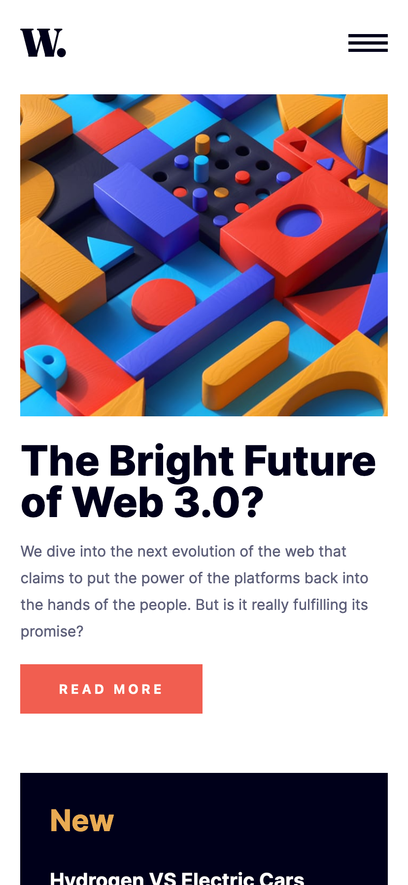
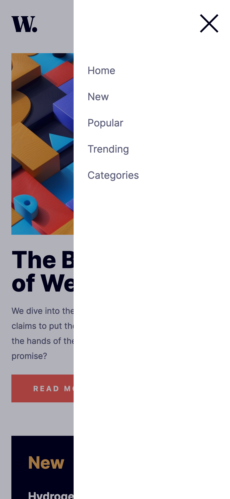
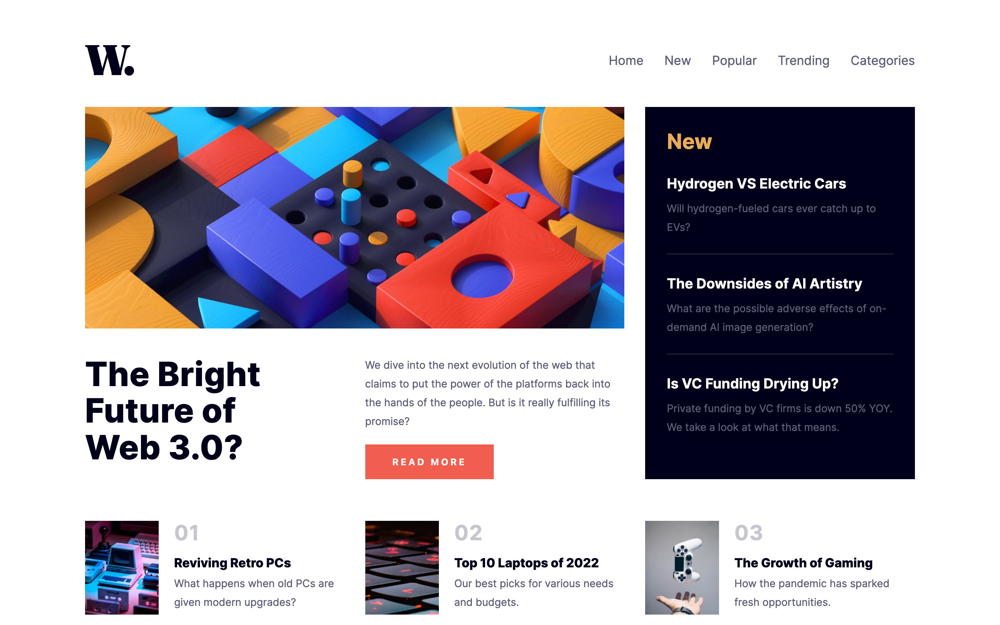

# Frontend Mentor - News homepage solution

This is a solution to the [News homepage challenge on Frontend Mentor](https://www.frontendmentor.io/challenges/news-homepage-H6SWTa1MFl). Frontend Mentor challenges help you improve your coding skills by building realistic projects. 

## Table of contents

- [Overview](#overview)
  - [The challenge](#the-challenge)
  - [Screenshot](#screenshot)
  - [Links](#links)
- [My process](#my-process)
  - [Built with](#built-with)
  - [What I learned](#what-i-learned)
  - [Continued development](#continued-development)
  - [Useful resources](#useful-resources)
- [Author](#author)
- [Acknowledgments](#acknowledgments)

## Overview

### The challenge

Users should be able to:

- View the optimal layout for the interface depending on their device's screen size
- See hover and focus states for all interactive elements on the page

### Screenshot

<table>
    <tr>
        <td>
            
            
        </td>
    </tr>
    <tr>
        <td>
            
        </td>
    </tr>
</table>

### Links

- Solution URL: [here](https://www.frontendmentor.io/solutions/news-homepage-project-created-using-reactjs-and-vite-PL3Lu83gXK)
- Live Site URL: [here](https://zun-liang.github.io/news-homepage/)

## My process

### Built with

- Semantic HTML5 markup
- CSS custom properties
- Flexbox
- CSS Grid
- Mobile-first workflow
- [React](https://reactjs.org/) - JS library

### What I learned

- useEffect

### Continued development

- Advanced React
- Styled-Components
- Tailwind
- Next.js

## Author

- Website - [Zun Liang](https://zun-liang.github.io/)
- Frontend Mentor - [@zun-liang](https://www.frontendmentor.io/profile/zun-liang)
